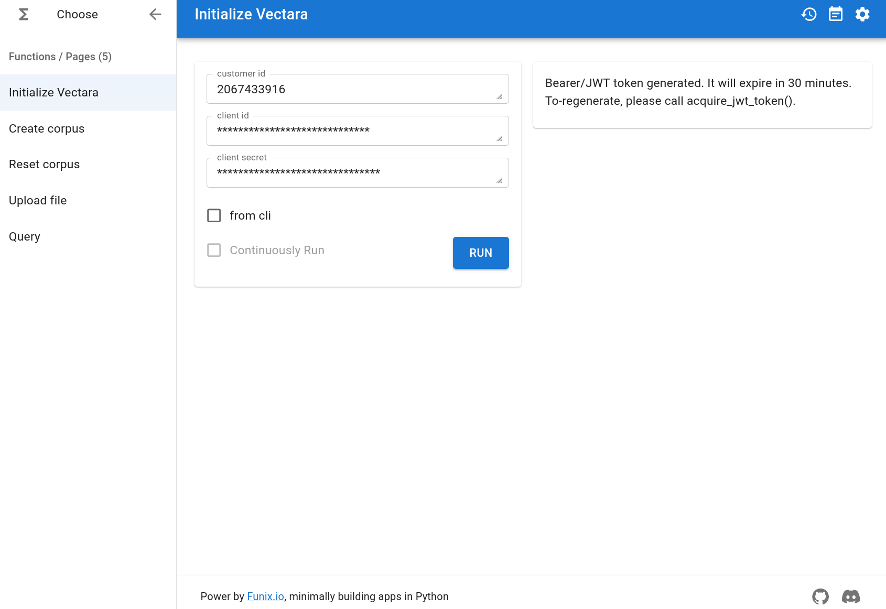
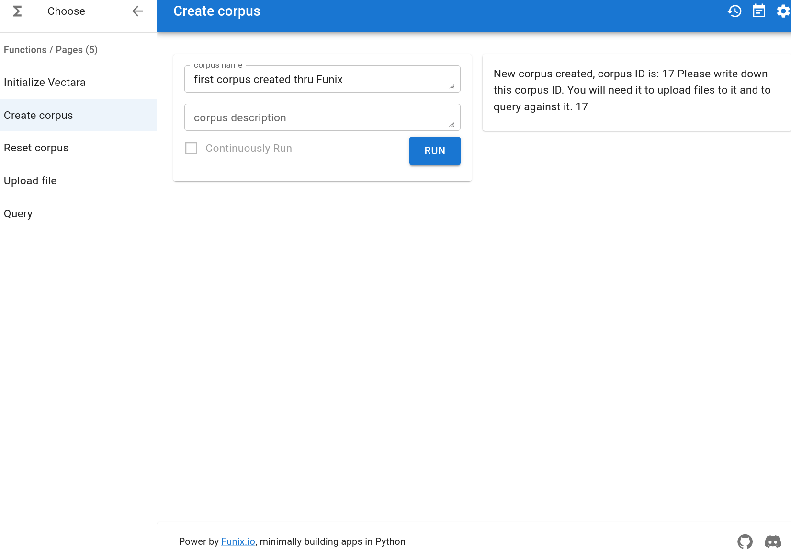
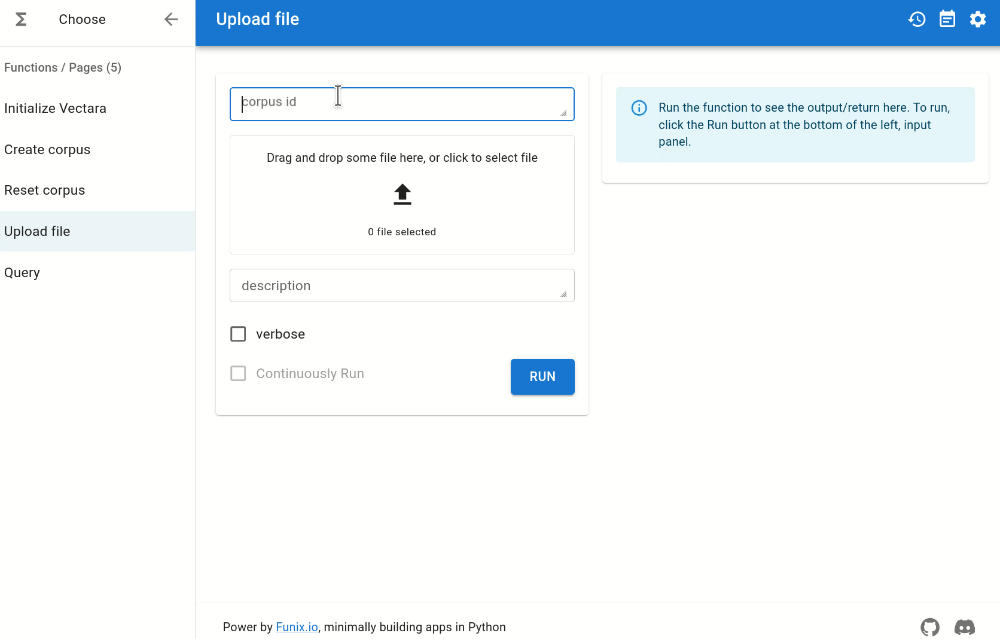
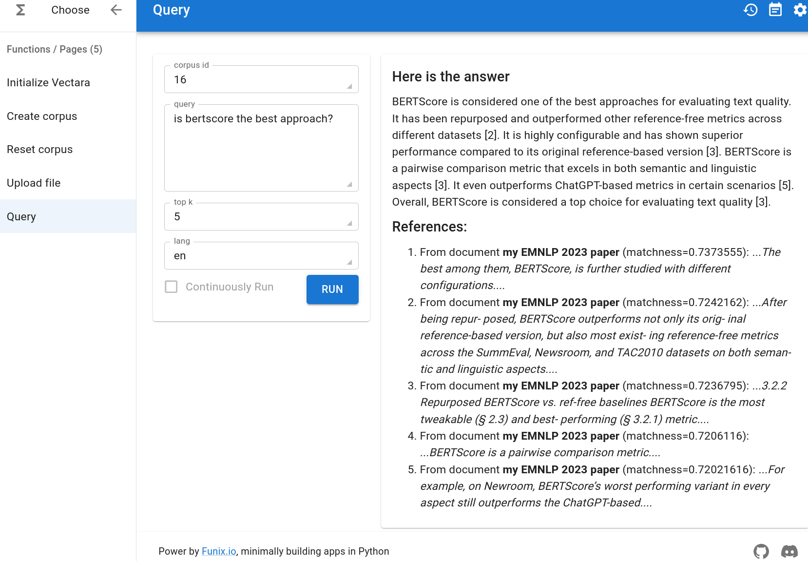

# An Unofficial Python SDK and CLI for Vectara's RAG platform

<div align="center">
<h3>

[](https://badge.fury.io/py/vektara)
[Reference Manual](https://vektara.readthedocs.io/en/latest/)

</h3>
</div>

## Installation

```bash
pip install vektara # Stable
# OR
pip install "git+https://github.com/forrestbao/vektara.git" # Nightly
# OR
# Development mode where local changes are reflected immediately
git clone https://github.com/forrestbao/vektara.git
pip install -e .
```

## Hello, world!

Here are the basic steps in RAG:
1. Creating a corpus, a collection of documents.
2. Ingestion: upload documents to a corpus.
3. Querying: ask questions to the corpus.

```python
from vektara import Vectara

client = Vectara() # get credentials from environment variables

corpus_id = client.create_corpus('founding documents of the US')

client.upload(corpus_id, './test_data/US_Constition.txt')
client.upload(corpus_id, './test_data/Declaration_of_Independence.txt')

client.query(corpus_id, 'What should I do if the government becomes unjust?')
```

## Before you start: credentials

### Obtaining Vectara credentials

This client supports authentication in both Vectara's [Personal API key](https://docs.vectara.com/docs/console-ui/personal-api-key) and [OAuth2](https://docs.vectara.com/docs/console-ui/app-clients). In either case, you need to obtain [customer ID](https://docs.vectara.com/docs/console-ui/vectara-console-overview#view-the-customer-id) as well.

### Setting up credentials

Following the convention of OpenAI's client, we recommend setting credentials as environment variables. You can save them as a bash script and simply `source` it before using the SDK.

```bash
export VECTARA_CUSTOMER_ID=123 # Required regardless of the authentication method

# For using Personal API Key to authenticate
export VECTARA_API_KEY=abc

# For using OAuth2 to authenticate
export VECTARA_CLIENT_ID=abc
export VECTARA_CLIENT_SECRET=xyz

# If both API key and OAuth2 credentials are set, the API key supercedes OAuth2.

# optional, if you are using a proxy like LlaMasterKey https://github.com/TexteaInc/LlaMasterKey/
export VECTARA_BASE_URL="http://127.0.0.1:8000/vectara"
export VECTARA_PROXY_MODE=true # Enable proxy mode
```

Alternatively, you can pass in your credentials as arguments when [initializing the client](https://vectara-python-cli.readthedocs.io/en/latest/#vectara.vectara.__init__).

## Using the Python SDK

Here are the resources to learn the Python SDK:
1. [Reference manual](https://vectara-python-cli.readthedocs.io/en/latest/)
2. [Crash course](https://vectara-python-cli.readthedocs.io/en/latest/crash_course.html)
3. [Demos](./demos)

The SDK supports the following operations. Detailed usages can be found in the [reference manual](https://vectara-python-cli.readthedocs.io/en/latest/).
1. Create a corpus
2. Reset a corpus (cleans out documents in a corpus but keeps the corpus and metadata)
3. List the documents in a corpus
4. Add documents to a corpus
   * From local file(s)/folder
   * From a list of chunks (`str`) without any hierarchy
   * From a nested list of sections hierarchically but you don't control chunking - a section is a list of `str`'s or sections.
5. Query a corpus
6. Set filters for a corpus which is a job in a queue
7. List a job (e.g., filter setting) in a corpus

## Using the CLI client

The features in the CLI client are similar to the SDK.
To learn the command line usage, run `vectara --help`.

You must [obtain and set up your Vectara credentials as environment variables](#before-you-start-credentials) before using the command line interface.

```bash
# create a corpus
vektara create_corpus 'my knowledge base'
# output: corpus_id = 12

# upload a file to the corpus
vektara upload 12 one_file.pdf # corpurs_id = 12

# upload a folder to the corpus
vektara upload 12 ./a_folder_of_documents # corpurs_id = 12

# query the corpus
vektara query 12 'Vectara allows me to search for anything, right?' --top_k=5  # corpurs_id = 12

# reset the corpus
vektara reset_corpus 12 # corpurs_id = 12
```

## The GUI client via Funix

The SDK can be converted into a web interface via [Funix](http://funix.io). You can drag and drop to add a file to your Vectara corpus.

```python
pip install funix
funix src/vektara/__init__.py
```

Then you can access the web interface at `http://localhost:3000` (the port number maybe different if port 3000 is occupied).

Below please find the screenshots.









**Known bugs**: Funix seems to have some memory leakage issues that the web interface may freeze after uploading a file. If that happens, please kill the process and restart the web interface.

### Stylish query results

The query results are typeset Markdown ready to be rendered. A query result includes the following info:

* A summary with citations and matching scores with respect to the query
* References cited by the summary

```markdown
### Here is the answer
To rearrange objects, you can utilize the "direction" attribute in a Funix decorator [1]. Manually resizing and positioning objects can be a tedious and inefficient process [2]. Another approach is to use a collision-free algorithm for auto-layout, where scopes will be resized to fit the objects inside [4]. An example of arranging objects in a column-reverse direction can be seen in the ChatGPT multiturn app [3]. Additionally, organizing your canvas with scopes can help in rearranging objects effectively [5]. Remember to experiment with these methods to find the best arrangement for your specific needs.

### References:

1. From document **funix.md** (matchness=0.673933):
  _...You can change their order and orientation using the "direction" attribute in a Funix decorator...._

2. From document **codepod.md** (matchness=0.65305215):
  _...It is painful and inefficient to resize and position the pods and scopes manually...._

3. From document **funix.md** (matchness=0.6520513):
  _...The example below shall be self-explaining:
A more advanced example is our ChatGPT multiturn app where "direction = "column-reverse"" so the message you type stays at the bottom...._

4. From document **codepod.md** (matchness=0.6495899):
  _...default}alt="Example banner"width="600"/>
After auto-layout, the pods and scopes are organized by a collision-free algorithm, and the scopes will be resized to fit the pods inside...._

5. From document **codepod.md** (matchness=0.6460015):
  _...Organize your Canvas with scopes..._
```

## This SDK/CLI/GUI vs. Vectara's official RESTFul API
* Type less and more done. No boilerplate code.
* Copy-and-pastable examples and Jupyter notebooks to jumpstart you.
* Forget about low-level details, e.g., all metadata fields are automatically set to filterable -- under construction.
* More ways to interact
  * Command line interface (CLI)
  * GUI powered by [Funix.io]http://Funix.io) for quickly building web apps that ordinary people can use.
* More features:
  * Upload an entire folder.
  * Stylish Markdown printout for query response (see [`demo_simple.ipynb`](./demo_simple.ipynb)).
  * Log user feedback from the GUI in a local SQLite database for evaluating the quality of search and RAG.
  * Pairable with [LlamaKey.ai](http://llamakey.ai) or any API router to manage API keys and throttle requests.

## Questions

Contact forrest at vectara dot com

## Disclaimer

This is an UNofficial SDK and CLI for Vectara's RAG platform.
Use at your own risk.
Vectara does NOT provide support for this SDK or CLI.
